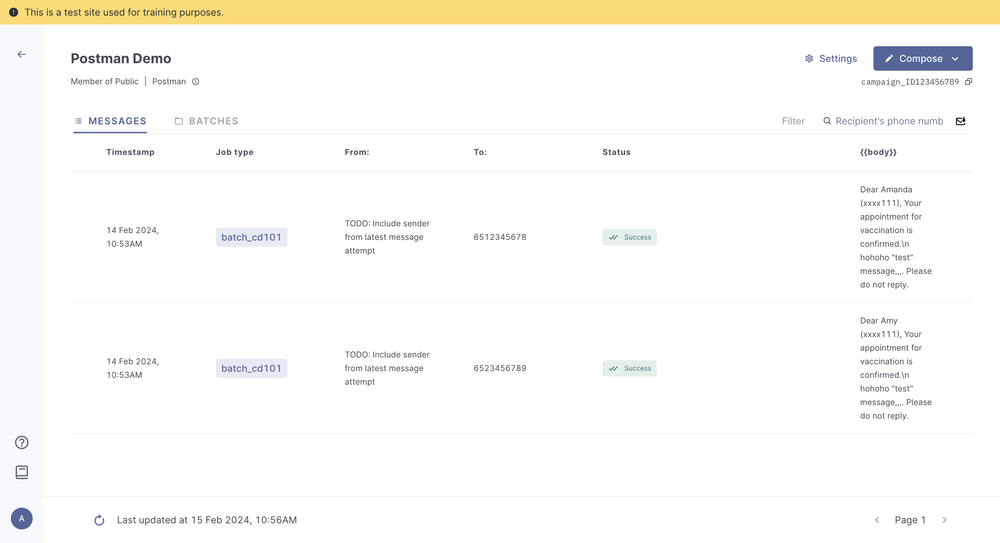
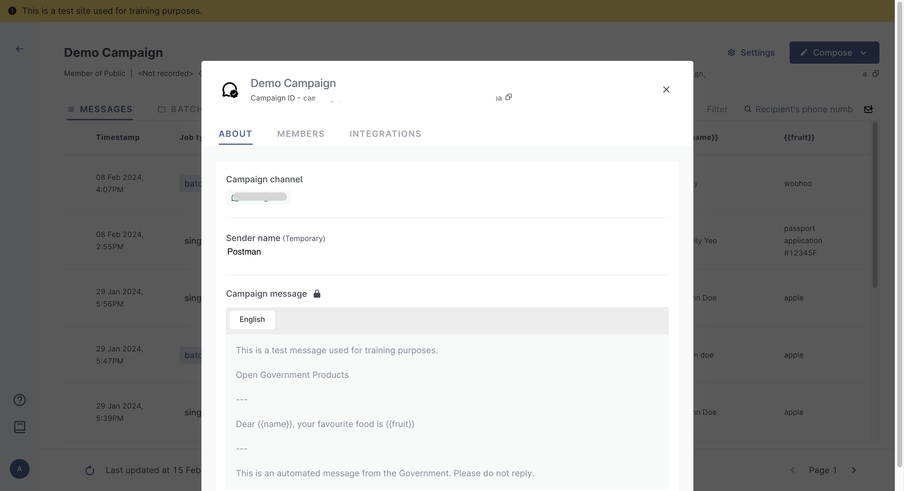
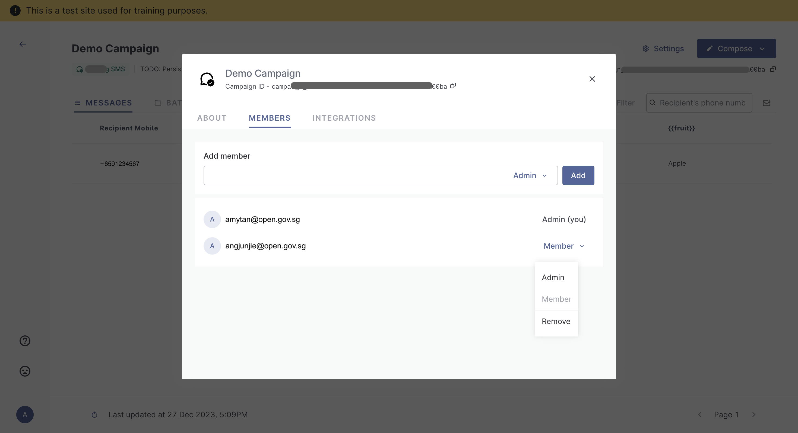
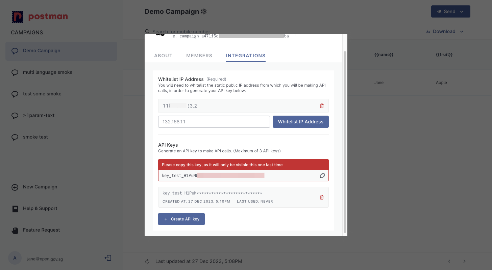

# ⚙️ Campaign Settings

You will be able to obtain your campaign API keys and whitelist your IP address from your campaign's `settings` pop-up, under the `integrations` tab. This part will be accessible after you have [created](../postman-v2-general-user-guide/create-campaign/) and saved your campaign.&#x20;

Click on your campaign and the `settings` icon, this will open up your `settings` pop-up.


Please ignore `TODO: Persist sender ID` under the `Sender ID` field.


<figure><figcaption></figcaption></figure>

### Settings - About&#x20;

You will be able to view the following details

* Campaign ID
* Campaign Channel
* Campaign Message
* Download campaign logs

<figure><figcaption></figcaption></figure>

### Settings - Members

Learn about the two types of access rights in Postman.

| Admin                                                                                                                                                                                                       | Member                                                                                                     |
| ----------------------------------------------------------------------------------------------------------------------------------------------------------------------------------------------------------- | ---------------------------------------------------------------------------------------------------------- |
| anyone with a gov.sg email address                                                                                                                                                                          | may have a `gov.sg` email address OR have a whitelisted email domain\*                                     |
| can create campaigns                                                                                                                                                                                        | can access campaigns that they have been added to by admins, but _cannot_ create messages or new campaigns |
| can send messages within the campaigns                                                                                                                                                                      | can send messages within these specific campaigns                                                          |
| 
can access and amend campaign settings: - add other users to their campaigns (and select access rights of these users - see screenshot below) - whitelist IP addresses  - generate API keys
 | no access to campaign settings                                                                             |

<figure><figcaption></figcaption></figure>


For agency officers without a `.gov.sg` email domain, you will need to get `.gov.sg` email domain from your parent ministry.


### What are some special cases?

1. **Non `gov.sg` domains that are considered government entities**
   1. For now, this is limited to `aic.sg`, `synapxe.sg`, `edu.sg`
   2. \*By default, every user with this domains has _member_ access rights.
   3. Users with these domains who need **admin access** (i.e. can create campaigns, access and amend campaign settings) must request for specific email address whitelisting _through the agency PIC_ using this [form](https://form.gov.sg/65a78789a82e8aa7662f25b1)
   4. Otherwise, all users with these domains can already log into Postman and view campaigns they have been added to (i.e. member access)
2. **Vendors helping government entities with API integrations**
   1. In such cases, Postman will _not_ be granting vendors access to the portal. This means vendors with non-whitelisted email domains cannot log into Postman.
   2. Agency officers should log into Postman, create the campaign and craft the message, whitelist the IP addresses, generate the API keys and pass the API keys to the vendors for the necessary integration.
3. **Vendors helping government entities send messages on Postman UI**
   1. In such cases, agency PICs must [submit a request](https://form.gov.sg/657025a2d2bd350012c82eb0) for the Postman team to whitelist the vendor's domain. This will allow vendors to log into Postman, and view campaigns that the vendors have been added to by the agency admins.
   2. Vendors will then be able to log in and send messages, but _**not**_ create campaigns i.e. member access

### Integrations

Integrations are where you can whitelist your IP addresses and generate your API keys.&#x20;

#### Integrations - IP address whitelisting

Provide your IP address for whitelisting. You will be able to provide up to 20 IP addresses.

Whitelist only

* Static IP addresses
* IP addresses that you are using to call the Postman API.

Connect to a VPN before calling the Postman APIs.&#x20;

<figure><figcaption></figcaption></figure>

#### API Keys

You will only be able to obtain your API keys **after** you have whitelisted your IP address.&#x20;

One campaign can have up to 3 API keys.

<figure><figcaption></figcaption></figure>

#### Do API keys have an expiry?&#x20;

The API keys have no expiry.&#x20;

If you need to obtain a new API key, you can simply delete the old key and generate a new key.&#x20;
