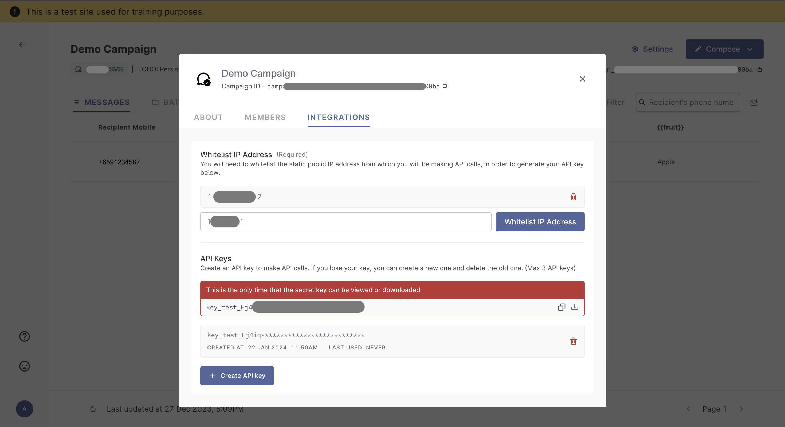

# ⚙ Campaign Settings

You will be able to obtain your campaign API keys and whitelist your IP address from your campaign's `settings` pop-up, under the `integrations` tab. This part will be accessible after you have [created](create-campaign.md) and saved your campaign.&#x20;

Click on your campaign and the `settings` icon, this will open up your `settings` pop-up.

<figure><figcaption></figcaption></figure>

### Settings - About&#x20;

You will be able to view the following details

* Campaign ID
* Campaign Channel
* Campaign Message
* Download campaign logs

<figure><figcaption></figcaption></figure>

### Settings - Members

There are 2 types of member access in Postman v2 - Admin and Member

<figure><figcaption></figcaption></figure>

#### Admin

Admins are users who have logged in with a `.gov.sg` email domain, and can create campaigns on behalf of their agencies.

As an admin, you are able to carry out the following actions

* Create campaigns
* Send messages
* Access and amend campaign settings
  * Add new users to their campaigns
  * Whitelist IP addresses
  * Generate API keys


For agency officers without a `.gov.sg` email domain, you will need to get `.gov.sg` email domain from your parent ministry.


Admins can also change the access of users within their own campaigns

<figure><figcaption></figcaption></figure>

#### Members

Members are users who are added to campaigns by admins.&#x20;

Members comprise of the following officers&#x20;

* Agency officers with a `.gov.sg` email domain
* Agency officers without a `.gov.sg` email domain
* Vendors sending out messages on behalf of agnecies.

As a member, you can carry out the following actions

* Send messages
* View campaigns that you have been added to

### Integrations

Integrations are where you can whitelist your IP addresses and generate your API keys.&#x20;

#### Integrations - IP address whitelisting

Provide your IP address for whitelisting. You will be able to provide up to 10 IP addresses.

Whitelist only

* Static IP addresses
* IP addresses that you are using to call the Postman API.

Connect to a VPN before calling the Postman APIs.&#x20;

<figure><figcaption></figcaption></figure>

#### API Keys

You will only be able to obtain your API keys **after** you have whitelisted your IP address.&#x20;

One campaign can have up to 3 API keys.

<figure><figcaption></figcaption></figure>

#### Do API keys have an expiry?&#x20;

The API keys have no expiry.&#x20;

If you need to obtain a new API key, you can simply delete the old key and generate a new key.&#x20;

<figure><figcaption></figcaption></figure>
