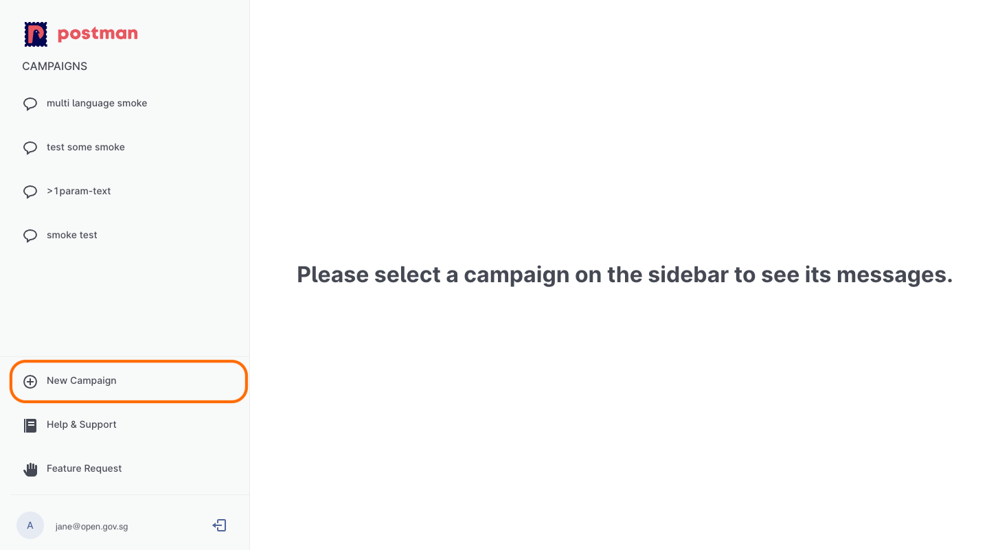
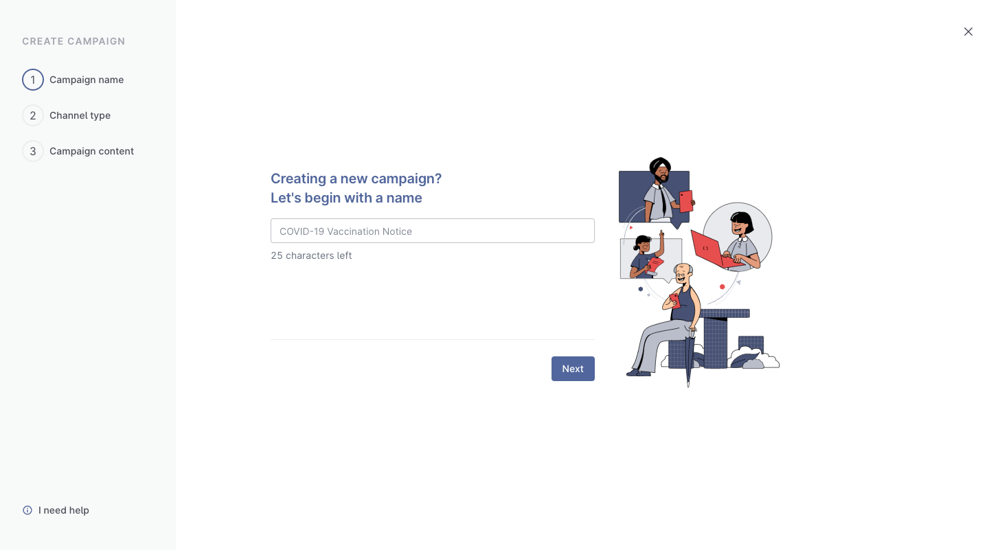

# 📢 Create Campaign


Campaign creators **must** log in with their `.gov.sg` email address. \
Users with no `.gov.sg` email address are **not allowed** to create campaigns.&#x20;


In order to obtain your API keys for system integration, you will need to&#x20;

1. Create Campaign and obtain a Campaign ID
2. [Whitelist your IP address](campaign-settings.md#ip-address-whitelisting)
3. [Generate your API keys](campaign-settings.md#api-keys)

## Home page

To start creating campaigns, select `New Campaigns` on your home page

<figure><figcaption></figcaption></figure>

### Create Campaign

You will be taken to the `Create Campaign` page and asked to name your campaign

<figure><figcaption></figcaption></figure>

### Available channels for campaign creation

Postman has 2 types of campaign channels available - **Member of Public** and **Internal Staff**

<figure><figcaption></figcaption></figure>

1. Member of Public: To send out messages to MOPs
2. Internal Staff - to send out with your own sender ID
   * You will need to provide your own Twilio credentials if you choose the `Internal Staff` option

### Campaign content

You will be prompted to type out your message content.&#x20;

Click here for more information regarding [\{{variables\}}](create-message.md#variables).

<figure><figcaption></figcaption></figure>
