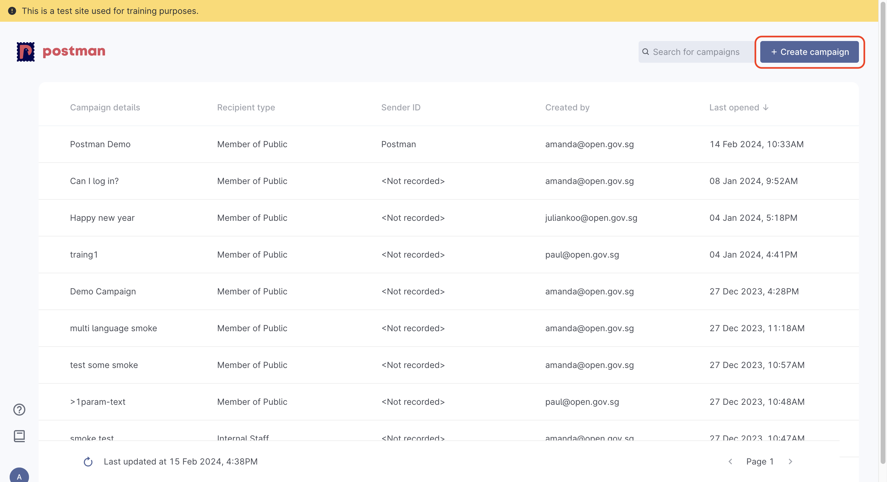

# 📢 Create Campaign


Campaign creators **must** log in with their `.gov.sg` email address. \
Users with no `.gov.sg` email address are **not allowed** to create campaigns. 


In order to obtain your API keys for system integration, you will need to 

1. Create Campaign and obtain a Campaign ID
2. [Whitelist your IP address](campaign-settings.md#ip-address-whitelisting)
3. [Generate your API keys](campaign-settings.md#api-keys)

## Home page

To start creating campaigns, select  `+ Create campaigns` on your home page

<figure><figcaption></figcaption></figure>

### Create Campaign

You will be taken to the `Create Campaign` page and asked to name your campaign

<figure><figcaption></figcaption></figure>

### Available channels for campaign creation

Postman has 2 types of campaign channels available - **Member of Public** and **Internal Staff**

1. Member of Public: To send out messages to MOPs
2. Internal Staff - to send out with your own sender ID
   * You will need to provide your own Twilio credentials if you choose the `Internal Staff` option


All messages sent out to MOPs via the `Members of Public` option will come from the `Postman`sender ID.


#### Temporary Sender Name (mid-April 2024 to launch)

Postman will be ready for use from mid-April 2024.&#x20;

Users will be able to use WOG Sender IDs that their agencies registered with SGNIC thus far. The sender IDs will appear as options under the `Select temporary sender name` field.

<figure><figcaption></figcaption></figure>

In the example below, the available sender IDs that the user's agency registered are `Government Technology Agency` and `Open Government Products`. The user will not be able to see other sender IDs registered by other agencies.&#x20;

<figure><figcaption></figcaption></figure>

### Campaign content

You will be prompted to type out your message content.&#x20;

Click here for more information regarding [\{{variables\}}](create-message.md#variables).

<figure><figcaption></figcaption></figure>


If you send a message with exact same content to the same person multiple times in 1 sitting in the same campaign:

For example, the message "Hi your appointment is on 1 Jan 2024" was sent to Tom 10 times within 1 batch send.

The telcos' automatic spam filter may be triggered . This means the message may not be delivered  to Tom's phone at all, even though it will pass Postman’s send filters and status is reflected as `delivered`.  See screenshot below on how the batch .csv is formatted in this failed example.


<figure><figcaption></figcaption></figure>
