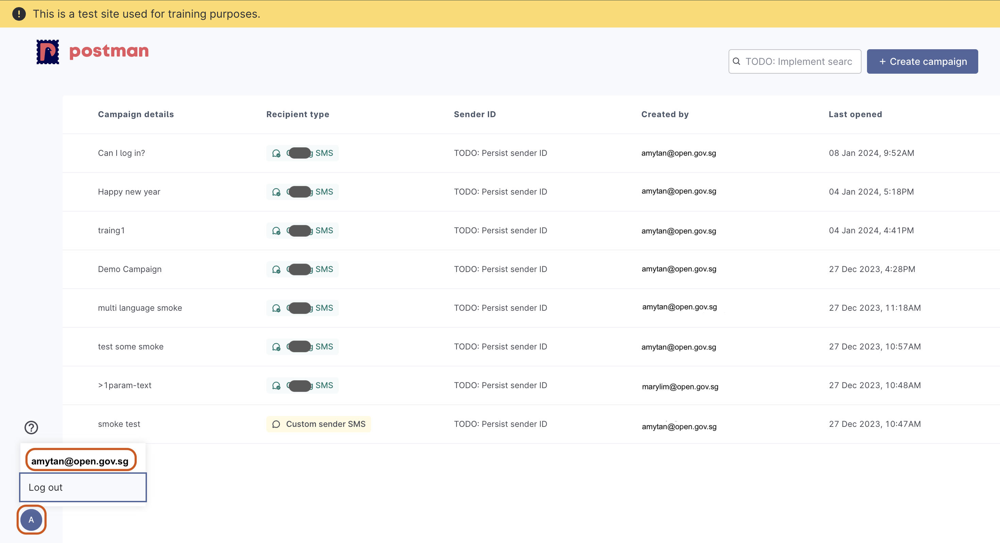

# ✏ Create Message

Sample Message

This is how your message will look like.

<figure><figcaption></figcaption></figure>

## **Header**

The `Header` corresponds to the email account that you have logged into Postman with.

You may check on the email account that you've used to log into Postman by clicking on the avatar at the bottom right of the page. Refer to the image for more information


If you have more than 1 official email address belonging to different agencies, ensure that you have [logged in with the correct email address](logging-into-postman-v2.md#singpass-login).



Please ignore `TODO: Persist sender ID` under the `Sender ID` field.


<figure><figcaption><p>Click on the avatar (bottom left) of page to check for the email address used to log into Postman</p></figcaption></figure>

If you need to change the agency in the `Header`, please [contact us ](https://form.gov.sg/657025a2d2bd350012c82eb0)with your use case.

eg. You are helping to send messages on behalf of another agency.

## Message content

This flow allows you to create your own message in Postman using an editor and can be used by both admin portal and API users.

#### Character count

Postman's message character count is set at a **maximum of 1530 characters**, inclusive of the header and footer.&#x20;

As a precautionary measure, agencies are strongly advised to set their character count for each message body at **600 characters,** excluding the header and footer. A warning sign will appear for messages beyond 600 characters.&#x20;

Upon reaching 1000 characters (excluding header and footer), message sending will be disabled.

Variable fields alone i.e. \{{variable\}} do not count as characters. However, each populated variable adds towards overall character count. e.g. \{{name\}} is 0 characters, but \{{name\}} = john is 4 characters.

In the bulk send format, any errors in the CSV file rows will result in failure to send all other messages in the campaign. You will need to fix the error(s) before all messages in the campaign can be sent.

#### Message Blocks

Each message _block_ comprises of 160 characters. In Postman, a single **SMS** can comprise of more than 160 characters. The blocks will be combined and sent out as a single **SMS** to recipients. It is recommended that the body content of each SMS should not exceed 600 characters.&#x20;

#### Variables

You will be able to create multiple `{{variables}}`. You can then input the values of each `{{variable}}`when you send the message from the admin portal or via API.

<figure><figcaption></figcaption></figure>

Variables have to fulfil the following in order to be successfully created

* Can only contain lowercase letters, numbers and `_`
* Must start with a lowercase letter
* If multiple languages are selected, the same variables must be present in all `language` tabs.

#### Language tab

If you are sending out messages in other languages, you can select the correct `language` tab before you key in your message content.

1. Message Content
   * Content in the message body field of each `language` is **not automatically translated.**
   * As a user, you will be required to input the correct language text into the message body field.
   * eg. If you select Malay as your `language`, you should input your message **in Malay** into the message body field; messages will not be translated for you.
2. SMS Footer
   * The SMS Footer of each message changes with the `language` selected.
   * eg. If you select Malay as your `language,` the SMS footer will change to Malay.

#### Request Body example


```json
{
    "recipient": "6599999999",
    "language": "english",
    "values": {
        // The following values are values for the parameters in the example template
        "name": "John Doe",
        "clinic": "Example Clinic",
        "date": "11 Dec 2023",
        "time": "11:30 am",
        "callback_link": "https://examplelink.gov.sg"
    }
}
```


**CSV example for batch send**


```csv
recipient,language,name,clinic,date,time,callback_link
6599999999,ENGLISH,John Doe,Example Clinic,11 Dec 2023,11:30 am,https://examplelink.gov.sg
```


### **A**PI users who do not want to manage your message templates within Postman

If you are an API user that

* manages message templates within your own system
* uses Postman solely for sending out the full text of your message

you may create a single variable, `{{body}}`, and insert the message into the `{{body}}` variable.

<figure><figcaption></figcaption></figure>

**Request Body example - single variable `{{body}}`**


```
{
    "recipient": "6599999999",
    "language": "english",
    "values": {
    // The following values are values for the parameters in the example template
        "body": "Fill in your system constructed message here"
    },
}
```


#### Request Body example - single variable `{{body}}` and line breaks


```
{
    "recipient": "6599999999",
    "language": "english",
    "values": {
    // The following values are values for the parameters in the example template
        "body": "Dear Amy \n\nYour appointment for VACCINATION is confirmed.\n\nPlease do not reply to this message."
    },
}
```


**CSV example for batch send - single variable `{{body}}`**


```
recipient,language,body
6599999999,english,"Fill in your system constructed message here"
```


#### &#x20;CSV example - single variable `{{body}}` and line breaks


```
recipient,language,body
6591234567,english,"Dear Amy 

Your appointment for VACCINATION is confirmed.

Please do not reply to this message."
```


<figure><figcaption><p>Example of a CSV file</p></figcaption></figure>


If you are typing your batch messages in excel and saving it as a .csv after, `""` will automatically be added to message bodies that includes commas, quotations and line breaks in them.  \
If you are typing out your csv messages in a text editor, you will need to encase your messages in quotation marks or you will not be able to upload your file onto Postman.&#x20;

