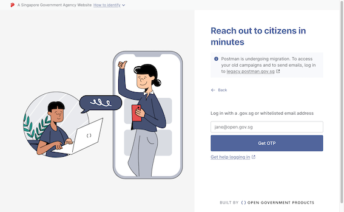
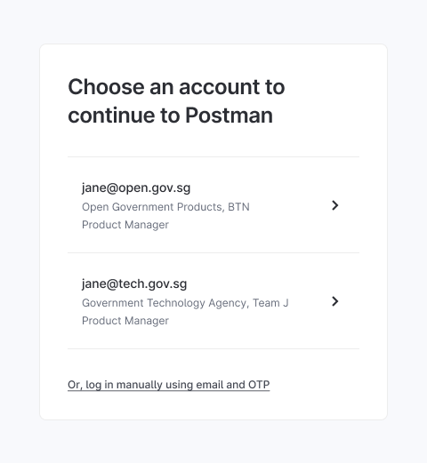

# 🔐 Logging into Postman v2

## Government Officers

There are 2 methods of logging into Postman -  Singpass or your `.gov.sg` email address.

You can only login to Postman v2 via SingPass if you have a `gov.sg` email address

<figure><figcaption></figcaption></figure>


Vendors may request for access to Postman v2 to **view** campaigns

Please request for access from a government officer.


#### **Email login**

If you selected email login, you will need to key in an OTP that is sent to your email address.

<figure><figcaption></figcaption></figure>

#### **Singpass login**


Singpass login is only available for users with a`.gov.sg` email address and have their details stored within [POCDEX](https://docs.id.gov.sg/faq-users) by their HR. If you are unable to login via SingPass, please switch to [Email login](logging-into-postman-v2.md#email-login) instead.&#x20;


If you have selected SingPass login, you will be taken to the SingPass login page.&#x20;

For officers with more than 1 official `gov.sg` email address belonging to different agencies, you will be able to select which agency you wish to log in with.

<figure><figcaption></figcaption></figure>

### Agency users without a `gov.sg` email domain

The following agencies without a `gov.sg` email domain can access Postman and are given [member access](../postman-v2-admin-portal-for-api-users-mop/campaign-settings.md#settings-members).&#x20;

* `edu.sg`
* `synapxe.sg`
* `aic.sg`


More information for users who require admin access can be found [here](../postman-v2-admin-portal-for-api-users-mop/campaign-settings.md#what-are-some-special-cases).

