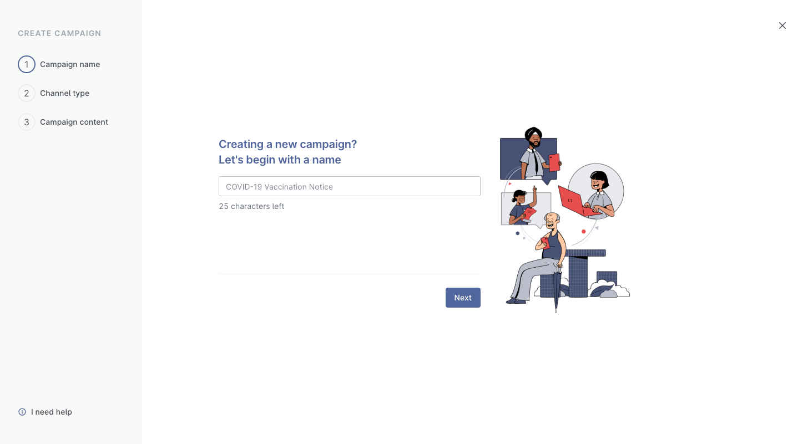
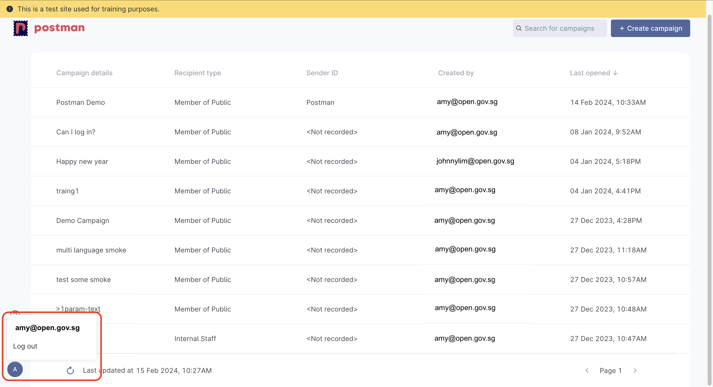

# 📢 Create Campaign


Campaign creators **must** log in with their `.gov.sg` email address. \
Users with no `.gov.sg` email address are **not allowed** to create campaigns.&#x20;


#### Campaign Creation and API keys for API users

Campaign creation should be the first step for all users, regardless if they are Admin portal, API users or SFTP users.&#x20;

In order for API users to obtain the API keys for system integration, you will need to&#x20;

1. Create Campaign and obtain a Campaign ID
2. [Whitelist your IP address](../postman-v2-admin-portal-for-api-users/campaign-settings.md#ip-address-whitelisting)
3. [Generate your API keys](../postman-v2-admin-portal-for-api-users/campaign-settings.md#api-keys)

## Create Campaign

To start creating campaigns, select  `+ Create campaigns` on your home page

<figure><figcaption></figcaption></figure>

Campaign creation will consist of 3 steps:

1. [Campaign name](create-campaign.md#campaign-name)
2. [Channel type](create-campaign.md#id-2.-channel-type)
3. [Campaign content](create-campaign.md#id-3.-campaign-content)

### 1. Campaign Name

Upon clicking on `+ Create Campaign` you will be taken to the campaign creation page and asked to name your campaign.

<figure><figcaption></figcaption></figure>

### 2. Channel Type

Postman has 2 types of campaign channels available - **Member of Public** and **Internal Staff**

1. Member of Public: To send out messages to MOPs
2. Internal Staff - to send out with your own sender ID
   * You will need to provide your own Twilio credentials if you choose the `Internal Staff` option

<figure><figcaption></figcaption></figure>


All messages sent out to MOPs via the `Members of Public` option will come from the `Postman`sender ID.


#### Temporary Sender Name (mid-April 2024 to launch)

Postman will be ready for use from mid-April 2024.&#x20;

Users will be able to use WOG Sender IDs that their agencies registered with SGNIC thus far. The sender IDs will appear as options under the `Select temporary sender name` field.

<figure><figcaption></figcaption></figure>

In the example below, the available sender IDs that the user's agency registered are `Government Technology Agency` and `Open Government Products`. The user will not be able to see other sender IDs registered by other agencies.&#x20;

<figure><figcaption></figcaption></figure>

### 3. Campaign content


You will not be able to edit your campaign content after creating your campaign.&#x20;


The campaign content is the content in the SMS that you will be sending out. You will be prompted to type out your campaign's message content.

There are different parts to the campaign content screen:

* [Message preview](create-campaign.md#message-preview)
* [Language tab](create-campaign.md#language-tab)
* [Message content](create-campaign.md#message-content)
* [Character count](create-campaign.md#character-count)

<figure><figcaption></figcaption></figure>

### Message Preview

This is how your message will look like:

<figure><figcaption>
Message Preview
</figcaption></figure>

#### **Header**

The `Header` corresponds to the email account that you have logged into Postman with.

You may check on the email account that you've used to log into Postman by clicking on the avatar at the bottom right of the page. Refer to the image for more information


If you have more than 1 official email address belonging to different agencies, ensure that you have [logged in with the correct email address](logging-into-postman-v2.md#singpass-login).


<figure><figcaption>
Click on the avatar (bottom left) of page to check for the email address used to log into Postman
</figcaption></figure>

If you need to change the name in the `Header`, please [contact us ](https://form.gov.sg/657025a2d2bd350012c82eb0)with your use case.

Some examples:

1. You are helping to send messages on behalf of another agency.
2. Your **product** is helping to send messages on behalf of another agency.
3. Your **product** is used by various agencies and recognised by product name.

### Language tab

If you are sending out messages in other languages, you can select the correct `language` tab before you key in your message content.

1. Message Content
   * Content in the message body field of each `language` is **not automatically translated.**
   * As a user, you will be required to input the correct language text into the message body field.
   * eg. If you select Malay as your `language`, you should input your message **in Malay** into the message body field; messages will not be translated for you.
2. SMS Header
   * SMS header will always remain in English.
3. SMS Footer
   * The SMS Footer of each message changes with the `language` selected.
   * eg. If you select Malay as your `language,` the SMS footer will change to Malay.

## Message content

This flow allows you to create your own message in Postman using an editor and can be used by both admin portal and API users.


For API users who do not want to manage your message templates within Postman, click [here](https://postman-v2.guides.gov.sg/postman-v2-admin-portal-for-api-users/create-message#api-users-who-do-not-want-to-manage-your-message-templates-within-postman) for more information.


### **Message parameters (variables)**

You can create multiple `{{variables}}` when typing out your message content. You can then input the values of each `{{variable}}`when you send the message from the admin portal or via API.

<figure><figcaption></figcaption></figure>

Variables have to fulfil the following in order to be successfully created

* Can only contain lowercase letters, numbers and `_`
* Must start with a lowercase letter
* If multiple languages are selected, the same variables must be present in all `language` tabs.

### Character count

Postman's message character count is set at a **maximum of 1530 characters**, inclusive of the header and footer.&#x20;

As a precautionary measure, agencies are strongly advised to set their character count for each message body at **600 characters,** excluding the header and footer. A warning sign will appear for messages beyond 600 characters.&#x20;

Upon reaching 1000 characters (excluding header and footer), message sending will be disabled.

Message parameters alone i.e. `{{variable}}` do not count as characters. However, each populated message parameter adds towards overall character count. e.g. `{{name}}` is 0 characters, but `{{name}}` = `john` is 4 characters.

#### Message Blocks

Each message _block_ comprises of 160 characters. In Postman, a single **SMS** can comprise of more than 160 characters. The blocks will be combined and sent out as a single **SMS** to recipients. It is recommended that the body content of each SMS should not exceed 600 characters.&#x20;

