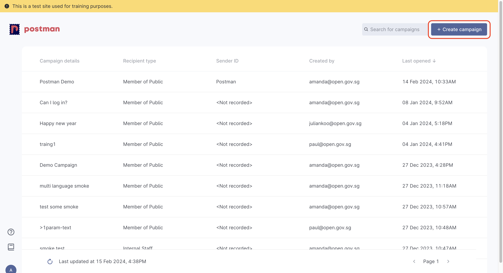

# 📢 Create Campaign


Campaign creators **must** log in with their `.gov.sg` email address. \
Users with no `.gov.sg` email address are **not allowed** to create campaigns.&#x20;


#### Campaign Creation and API keys for API users

Campaign creation should be the first step for all users, regardless if they are Admin portal, API users or SFTP users.&#x20;

In order for API users to obtain the API keys for system integration, you will need to&#x20;

1. Create Campaign and obtain a Campaign ID
2. [Whitelist your IP address](../../postman-v2-admin-portal-for-api-users/campaign-settings.md#ip-address-whitelisting)
3. [Generate your API keys](../../postman-v2-admin-portal-for-api-users/campaign-settings.md#api-keys)

## Create Campaign

To start creating campaigns, select  `+ Create campaigns` on your home page

<figure><figcaption></figcaption></figure>

Campaign creation will consist of 3 steps:

1. [Campaign name](./#campaign-name)
2. [Channel type](./#id-2.-channel-type)
3. [Campaign content](./#id-3.-campaign-content)

### 1. Campaign Name

Upon clicking on `+ Create Campaign` you will be taken to the campaign creation page and asked to name your campaign.

<figure><figcaption></figcaption></figure>

### 2. Channel Type

Postman has 2 types of campaign channels available - **Member of Public** and **Internal Staff**

1. Member of Public: To send out messages to MOPs
2. Internal Staff - to send out with your own sender ID
   * You will need to provide your own Twilio credentials if you choose the `Internal Staff` option

<figure><figcaption></figcaption></figure>


All messages sent out to MOPs via the `Members of Public` option will come from the `Postman`sender ID.


#### Temporary Sender Name (mid-April 2024 to launch)

**Users with existing sender IDs with SGNIC**

Postman will be ready only for users with existing Sender IDs that are registered with SGNIC from mid-April 2024.

These users will be able to use their agencies' registered sender IDs with SGNIC, where the sender IDs will appear as options under the `Select temporary sender name` field.

In the example below, the available sender IDs that the user's agency registered are `Government Technology Agency` and `Open Government Products`. The user will not be able to see other sender IDs registered by other agencies.&#x20;

<figure><figcaption></figcaption></figure>

<figure><figcaption></figcaption></figure>

**Users with no existing Sender IDs**

Users without registered sender IDs with SGNIC can only use Postman production site from 1 June 2024, where WOG will be able to select the standardised Sender ID from the dropdown list.

### 3. Campaign content


You will not be able to edit your campaign content after creating your campaign.&#x20;


The campaign content is the content in the SMS that you will be sending out. You will be prompted to type out your campaign's message content.

There are different parts to the campaign content screen:

* [Message preview](./#message-preview)
* [Language tab](./#language-tab)
* [Message content](./#message-content)
* [Character count](./#character-count)

<figure><figcaption></figcaption></figure>

