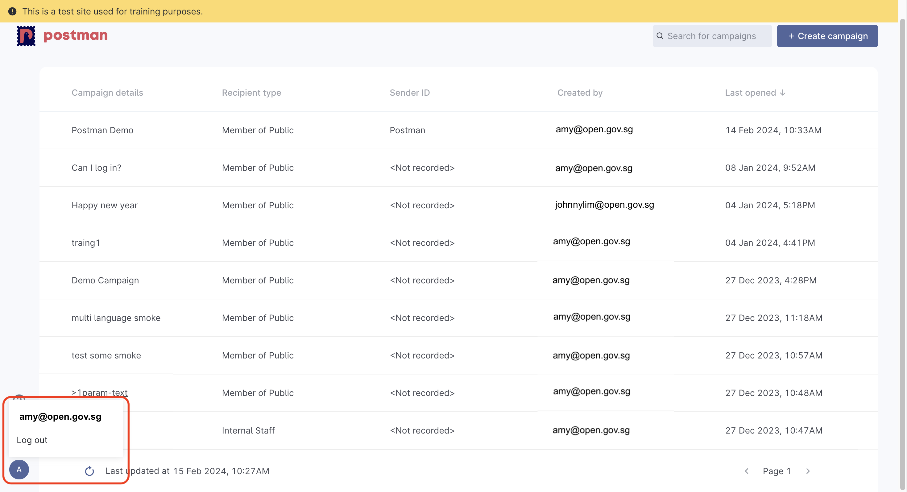

# Message Preview

### Message Preview

This is how your message will look like:

<figure><figcaption></figcaption></figure>

#### **Header**

The `Header` corresponds to the email account that you have logged into Postman with.

You may check on the email account that you've used to log into Postman by clicking on the avatar at the bottom right of the page. Refer to the image for more information


If you have more than 1 official email address belonging to different agencies, ensure that you have [logged in with the correct email address](../logging-into-postman-v2.md#singpass-login).


<figure><figcaption>
Click on the avatar (bottom left) of page to check for the email address used to log into Postman
</figcaption></figure>

If you need to change the name in the `Header`, please [contact us ](https://form.gov.sg/657025a2d2bd350012c82eb0)with your use case.

Some examples:

1. You are helping to send messages on behalf of another agency.
2. Your **product** is helping to send messages on behalf of another agency.
3. Your **product** is used by various agencies and recognised by product name.
